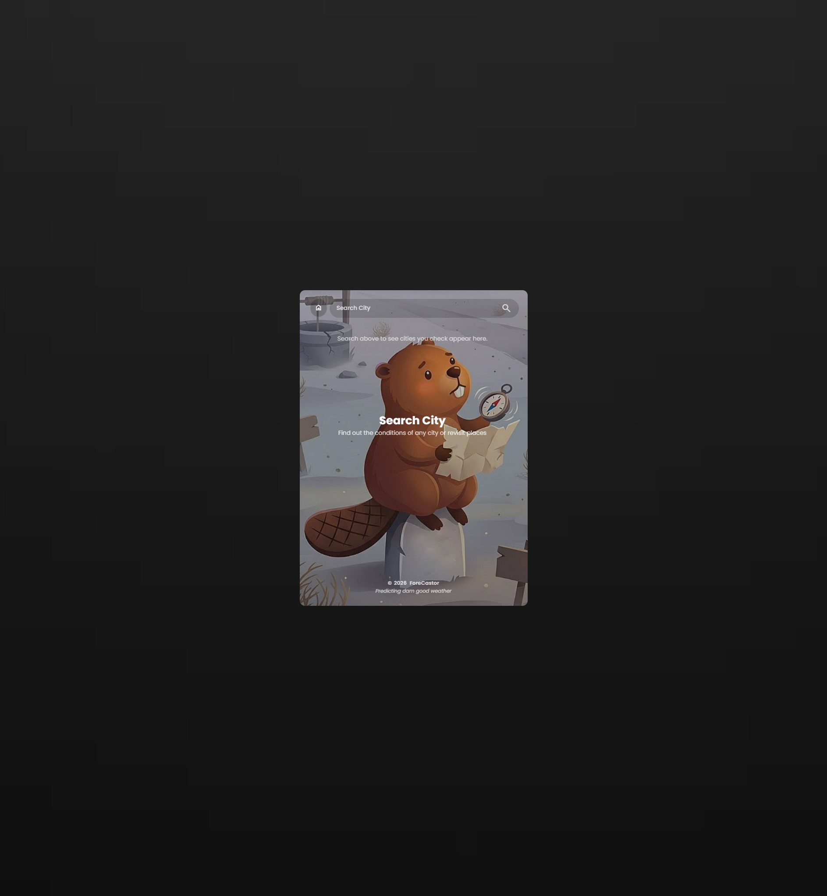
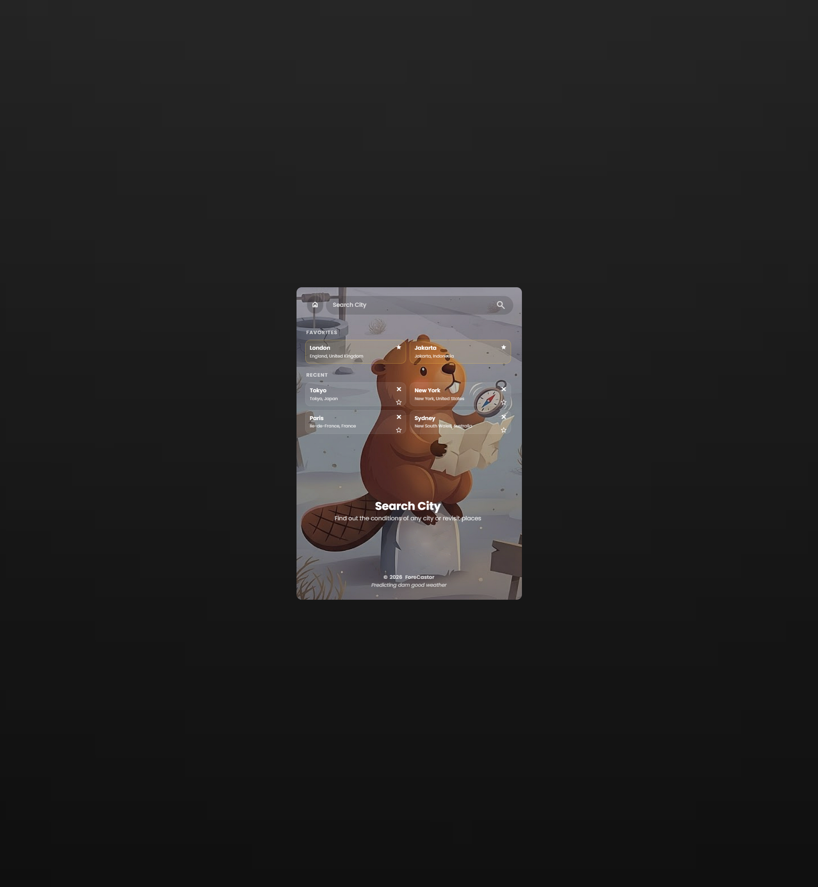
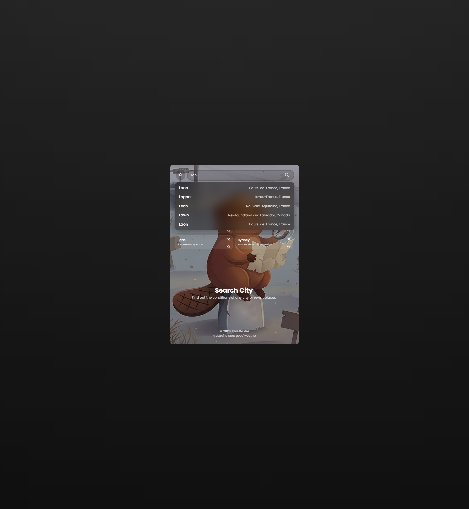
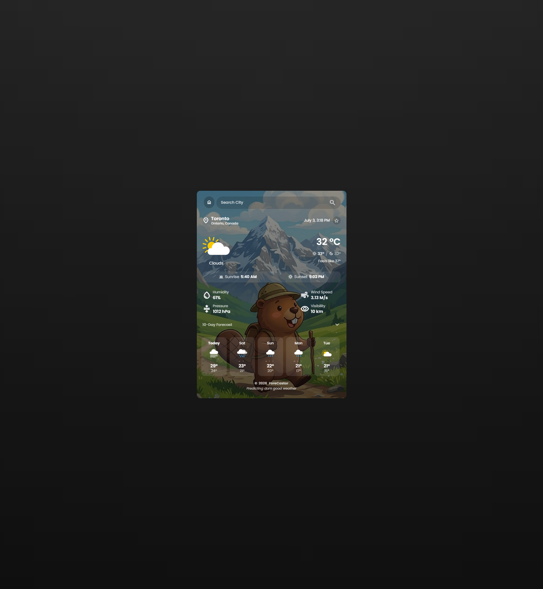
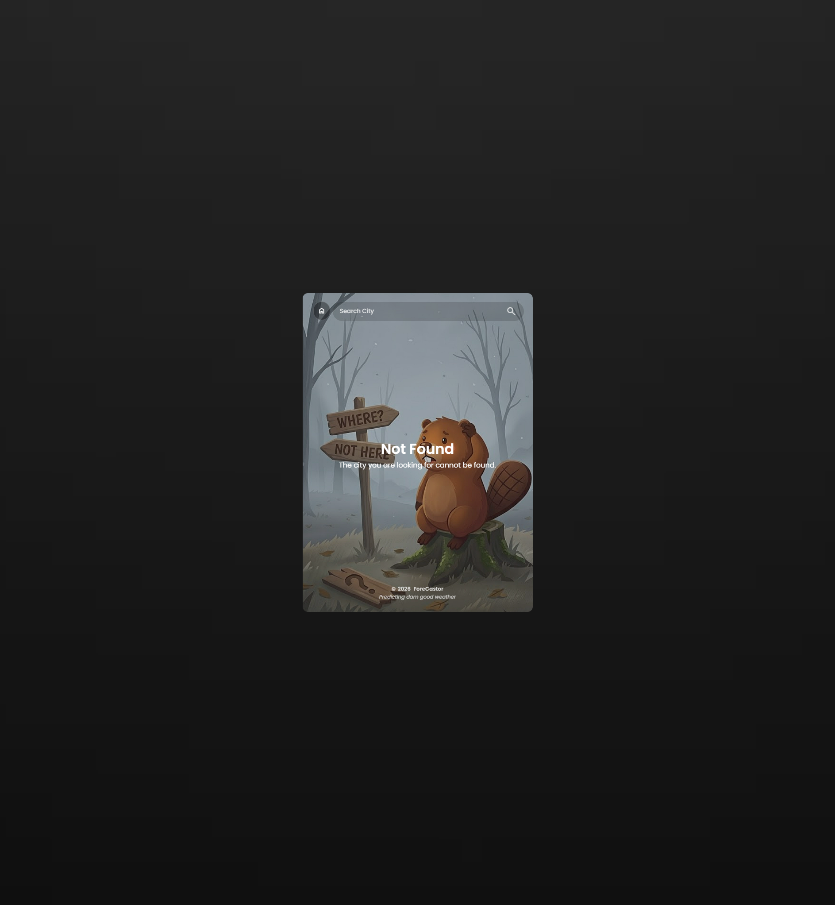

<div align="center">

# 🌤️ ForeCastor

### _Predicting dam good weather_

A minimalist, glassmorphic weather app for any city in the world.
Built with vanilla HTML, CSS, and JavaScript — **no frontend
framework, no build step, no bundler**. A small Node.js + Express
proxy stands in front of OpenWeatherMap so the API key never reaches
the browser.

</div>

---

## ✨ Features

- 🔎 **Live autocomplete** — type ≥ 2 characters in the search bar
  and OpenWeatherMap's geocoding API lists matching cities, with the
  matched substring visually highlighted.
- 🌡 **Current conditions** — temperature (with day / night pill and
  "feels like" reading), plus a 2×2 conditions grid covering
  **humidity, wind speed, pressure (hPa), and visibility** (auto-units
  to km or metres depending on the value).
- 🌅 **Sunrise & sunset pill** — auto-hidden at polar latitudes where
  the sun neither rises nor sets that day; otherwise formatted in the
  user's local timezone (e.g. _"6:24 AM"_).
- 📅 **10-day forecast strip** — sourced from **Open-Meteo** (no key
  required) and presented as a horizontally-scrollable card list.
  Falls back to OpenWeatherMap's 5-day / 3-hour forecast if Open-Meteo
  can't be reached.
- ⭐ **Favorites & recents** — tap the star to pin any city; the last
  six successful searches auto-populate a _Recent_ strip on the home
  dashboard. Persists across sessions via `localStorage` — no
  account, no backend store.
- 🌃 **Time-of-day backgrounds** — the card swaps to a sunny /
  evening / night / weather-specific background depending on the
  local time at the city you searched (sunrise / sunset drive the
  mood).
- ♿ **Accessible by default** — keyboard navigation through the
  autocomplete suggestions (↑/↓/Enter/Esc), ARIA `aria-pressed` state
  on the favorite stars, and explicit `aria-label`s on every action
  button for screen readers.
- 📱 **Responsive card layout** — the card sits centred over a blurred
  background, scales within clamped viewport margins, and degrades to
  single-column saved-city grids on viewports below 340 px.

---

## 🖼️ Screenshots

> The five images below live in [`docs/screenshots/`](docs/screenshots/).
> See [`docs/screenshots/README.md`](docs/screenshots/README.md) for a
> shot-by-shot capture guide.

### 1. Home dashboard — first run



### 2. Home dashboard with favorites & recents



### 3. Search autocomplete



### 4. Weather card — full details



### 5. Not-found state



---

## 🌄 Weather background gallery

The weather card swaps its background `jpg` based on the city's
current conditions _and_ its local time of day. Each asset below
lives in [`assets/weather/`](assets/weather/) and is layered under a
dimming gradient so white text stays readable on bright sky jpgs.

### Daytime weather — by OpenWeatherMap condition `id`

The day-time pick is driven by the current weather condition's
`id`. The first row whose range matches wins.

| Background                                                                    | Filename           | Used when…                                                                                                                                                                            |
| ----------------------------------------------------------------------------- | ------------------ | ------------------------------------------------------------------------------------------------------------------------------------------------------------------------------------- |
|  | `thunderstorm.jpg` | OWM id `200–232` — thunderstorm / lightning conditions.                                                                                                                               |
|            | `drizzle.jpg`      | OWM id `300–321` — light drizzle / freezing drizzle.                                                                                                                                  |
|                  | `rain.jpg`         | OWM id `500–531` — rain / shower conditions.                                                                                                                                          |
|                  | `snow.jpg`         | OWM id `600–622` — snow / sleet conditions.                                                                                                                                           |
|      | `atmosphere.jpg`   | OWM id `701–781` — mist, haze, fog, dust, sand, smoke.                                                                                                                                |
|                | `sunny.jpg`        | OWM id `800` — clear sky during the day.                                                                                                                                              |
|                | `clear.jpg`        | OWM id `801–804` — partly / broken / overcast clouds. The asset is named `clear.jpg` for legacy reasons even though it covers the _clouds_ family — there's no separate `clouds.jpg`. |

### Time-of-day mood overrides

When the city's local clock falls into one of the windows below, the
mood override beats the day-time weather pick — so a rainy night
still feels "nighty" rather than rainy.

| Background                                                          | Filename      | Used when…                                                                            |
| ------------------------------------------------------------------- | ------------- | ------------------------------------------------------------------------------------- |
|  | `evening.jpg` | **30 min before sunset → 2 hr after sunset** — golden hour + twilight.                |
|      | `night.jpg`   | **After evening → 30 min past tomorrow's sunrise** — full night + pre-dawn dim light. |

The mapping lives in `applyWeatherBackground()` /
`isEveningOrNight()` in [`script.js`](script.js). At polar latitudes
where OWM returns `sunrise = 0` and `sunset = 0`, the sunrise /
sunset pill is also hidden, and the day-time weather pick stands
alone.

---

## 🛠️ Tech Stack

| Layer       | Tech                                                              |
| ----------- | ----------------------------------------------------------------- |
| Frontend    | Vanilla HTML + CSS + ES2020 JavaScript (no framework, no bundler) |
| Backend     | Node.js + Express 5                                               |
| Weather API | OpenWeatherMap — current weather + 5-day / 3-hour forecast        |
| Daily (10d) | Open-Meteo (`/v1/forecast` daily endpoint, **no API key needed**) |
| Icons       | Google Material Symbols (Outlined)                                |
| Fonts       | Google Fonts — Poppins                                            |

---

## 📁 Project structure

```
WeatherApp/
├── index.html              # Single-page UI markup
├── style.css               # All styling (no preprocessor)
├── script.js               # Frontend logic + DOM rendering
├── server.js               # Express proxy + WMO-code mapping
├── package.json
├── package-lock.json
├── .env                    # ← you create this (see "Getting started")
├── .gitignore              # ignores node_modules + .env
├── assets/
│   ├── bg.jpg              # body background
│   ├── message/            # home + not-found message backgrounds
│   └── weather/            # icon SVGs + weather backgrounds
└── docs/
    └── screenshots/        # ← README images live here
```

---

## 🚀 Getting started

### Prerequisites

- **Node.js 18+** (Node 20 LTS recommended).
- **An OpenWeatherMap account** — the free tier is enough for
  personal / educational use. Free tier rate-limits: 60 calls/minute
  and 1,000,000 calls/month — plenty for one developer poking
  around.

### 1. Install dependencies

```bash
npm install
```

### 2. Create your `.env` file

> ### ⚠️ The `.env` file MUST contain **your own** OpenWeatherMap API key.
>
> The app reads it as `process.env.API_KEY` in `server.js`. **It is not
> included with this project** — you must generate the key yourself
> from OpenWeatherMap. Without a valid key, both `/weather` and `/geo`
> requests return `500 — API key is missing`, and the app shows the
> _"Not Found"_ screen on every search.
>
> 1. Sign up for a free account at
>    <https://home.openweathermap.org/users/sign_up>.
> 2. Verify your email, then open
>    <https://home.openweathermap.org/api_keys> and copy the default
>    key (or generate a fresh one labelled however you like).
> 3. At the project root, create a `.env` file with the variable
>    name **exactly** `API_KEY`:
>
>    ```env
>    API_KEY=your_openweathermap_api_key_here
>    ```
>
> _Note: the 10-day forecast strip uses Open-Meteo, which **does not
> require an API key**, so you only need the OpenWeatherMap one._

`.env` is already in `.gitignore`, but treat the key as sensitive
still.

### 3. Run the app

```bash
npm start
```

Then open <http://localhost:3000> in your browser. The Express
server serves both the API (`/weather`, `/geo`) and the static
frontend (`index.html`, `style.css`, `script.js`, `assets/`), so the
single `localhost:3000` origin hosts the whole app.

---

## 💡 How to use

| Action                 | How                                                                                                                                                                         |
| ---------------------- | --------------------------------------------------------------------------------------------------------------------------------------------------------------------------- |
| **Search a city**      | Type ≥ 2 chars in the search bar — suggestions appear automatically. Pick one with `↑`/`↓` + `Enter`, or click. Free-text submissions also work.                            |
| **Cancel a search**    | Tap the floating home chip in the top-left of the card (visible on every screen).                                                                                           |
| **Inspect conditions** | The weather card shows temp + day/night pill + "feels like" + a 2×2 conditions grid + sunrise/sunset + 10-day forecast strip.                                               |
| **Star a city**        | Tap the star icon on the weather card or anywhere the city appears in a list. The same star toggles in every surface.                                                       |
| **Delete a recent**    | Tap the `✕` on a recent card on the home dashboard.                                                                                                                         |
| **Clear all data**     | Open browser DevTools → _Application_ → _Local Storage_ and delete the `weatherApp.favorites` / `weatherApp.recents` keys (or run `localStorage.clear()` from the console). |
| **Keyboard tips**      | `Tab` closes the dropdown, `Esc` closes it, `↑`/`↓` navigates suggestions, `Enter` picks the active one.                                                                    |

---

## 🧠 How it works (high level)

- **Frontend** — vanilla ES2020. Two `localStorage` keys hold all
  state: `weatherApp.favorites` and `weatherApp.recents` (last six
  successful searches, FIFO). Each saved entry is the minimum needed
  to re-fetch the city: `{ name, country, state?, lat?, lon? }`. The
  current city's weather card writes to recents and toggles the
  star state in real time.

- **Backend** — a small Express proxy in `server.js`. Three jobs:
  1. Hides the API key from the browser (the key never crosses the
     network from the client; the server makes all
     OpenWeatherMap calls).
  2. Augments the OpenWeatherMap current-weather response with a
     10-day daily forecast from **Open-Meteo** (no key needed).
     Maps Open-Meteo's WMO weather codes back to OpenWeatherMap's
     `id` + `main` so the existing `getWeatherIcon` mapping in
     `script.js` works unchanged.
  3. Best-effort secondary geocoding pass to recover the city's
     state / region — surfaces as _"State, Country"_ in the
     weather card.

- **Backgrounds** — `applyWeatherBackground()` in `script.js`
  layers a dimming gradient over a `clear.jpg / sunny.jpg / evening.jpg /
night.jpg / rain.jpg / snow.jpg / etc.` jpg from `assets/weather/`,
  picked by the current condition and the local time-of-day window
  (golden hour ↦ evening ↦ night ↦ pre-dawn dim light).

---

## ⚠️ Limitations

- **Personal / educational use only.** Neither OpenWeatherMap's free
  tier nor Open-Meteo's free tier is licensed for commercial
  redistribution.
- The free OpenWeatherMap key rate-limits aggressively
  (~60 req/min). A typing user may occasionally see a 429 on rapid
  autocomplete.
- Viewports below ~360 px wide show the conditions grid and the
  saved-city grid a bit tight; the search bar scales accordingly
  but the layout was tuned on widths ≥ 340 px.

---

## 🤝 Contributing

Issues and PRs welcome. If you add a feature:

1. Keep the front-end zero-build — no transpiler, no bundler, no
   `package.json` `<script>` entrypoint change.
2. Match the existing naming: camelCase variables in `script.js`,
   kebab-case classes in HTML/CSS, behaviour without CJS imports.
3. If you touch the server, mirror the user's API key convention
   (`process.env.API_KEY`) so existing `.env` files stay valid.

---

## 📄 License

ISC — see [`package.json`](package.json) for the canonical text.
